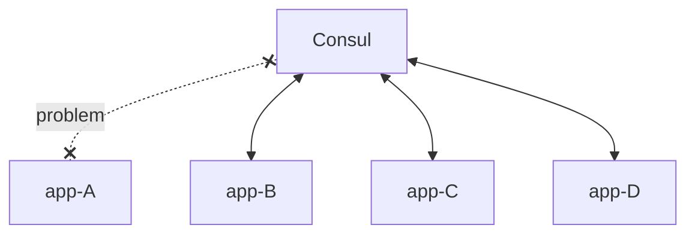

# SERVICE DISCOVERY

**en**: 
Let's imagine a scenario of distributed applications where they communicate with each other. In these cases, I need to know which machine I'm calling.

But let's imagine that one of these machines is being over-accessed, and now which machine or instance should be accessed to distribute the requests?

So now there are different machines, in different zones, and I need to know the IP and ports, and also whether or not I have permission to access them, and whether that instance is healthy or not.

Thinking about these contexts, what's the best way to find out which machine to access?

------------------
**pt**: 
Imaginando um cenário de aplicações distribuídas onde elas se comunicam entre si. Nesses casos preciso saber a maquina que estou chamando. 

Mas vamos imaginar que uma dessas máquinas está sendo super acessada e agora a qual máquina ou instancia deve ser acessada para distribuir as requisições? 

Então agora há maquinas diferentes, em zonas diferentes e preciso saber o IP e portas, também se tenho permissão ou não para acessá-las, se aquela instancia está saudável ou não.

Pensando nesses contextos, qual a melhor forma de descobrir qual máquina disponível para acessar?

------------------
## Service Discovery topics
- Discover available machines
- Segment machines to ensure security
- Resolution via DNS
- Health check
- Knowing whether or not I have permission to access an instance

## Hashicorp Consul
For this example I'm using Consul for testing, but the tool can be used with Kubernetes as well.
[https://www.consul.io/](https://www.consul.io/)

## Consul centralized service registry
In the consul healthy check there is an agent on each server that locally validates the health of the instance and notifies the consul in case of problems.

## Agent, client and server
- **Agent**: process deamont run in cluster's node executed in client mode or server mode.
- **Client**: Registry local services, perform and forwards the heath check.
- **Server**: Fully serverless, maintains cluster state, logs services and validete membership.

## RUN Consul on Docker

Run docker compose
<pre>
docker compose up -d
</pre>

Open consul docker containers
<pre>
docker exec -it consul-server-01 sh
</pre>

## Consul Nodes
Nodes consulting
<pre>
curl localhost:8500/v1/catalog/nodes
</pre>

## Nginx consulting
Note that I did not put nginx in docker compose. So install it manually in the client containers according to the settings in "services.json"

* necessary install dig `apk -U add bind-tools`
<pre>
dig @localhost -p 8600 nginx.service.consul
</pre>

<pre>
consul catalog nodes -service nginx
</pre>

<pre>
consul catalog nodes -detail
</pre>

Meybe is necessary a relaod into server containers to nginx
<pre>
consul reload
</pre>

## Consul RUN Multiple Servers
Run server in each container server
<pre>
consul agent -config-dir=/etc/consul.d
</pre>

Run client
<pre>
consul -agent -data-dir=/var/lib/consul
</pre>

## Consul dashboard
To run consul with the dashboard and see the health of your services, run the command below in each container to start the servers.
<pre>
consul agent -config-dir=/etc/consul.d
</pre>

Then put the url in the address bar.
http://localhost:8500/ui/dc1/services